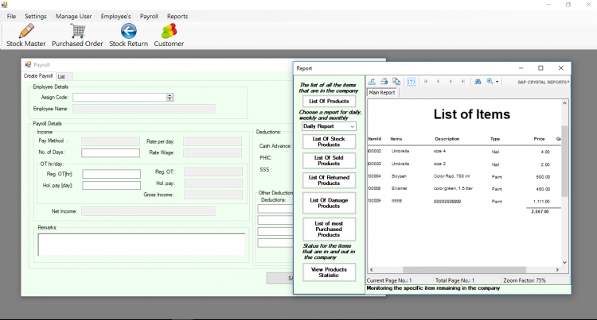

# Inventory with Payroll System in VB.Net and MySQL Database with Source Code

### Description

The Inventory with Payroll System is an automated system that provides great advantages to businesses or companies because this system will easily calculate employees’ salaries and other deductions quickly.

### Features
<ul>
  <li><strong>Manage Stocks</strong></li>
  <li><strong>Manage Customer Orders</strong></li>
  <li><strong>Manage Returned Customer Orders</strong></li>
  <li><strong>Manage Customer</strong></li>
  <li><strong>Manage Employee’s</strong></li>
  <li><strong>Manage Payroll</strong></li>
  <li><strong>Manage Settings</strong></li>
  <li><strong>Manage Users</strong></li>
  <li><strong>Inventory Reports</strong></li>
  <li><strong>Generates Payslip</strong></li>
  <li><strong>Login and Logout</strong></li>
</ul>

Visti [sourcecodester.com](https://www.sourcecodester.com/visual-basic-net/13188/inventory-payroll-system-vbnet.html) for more details for this VB.NET Project

#### Website Info

| Title | Inventory with Payroll System in VB.Net and MySQL Database with Source Code |
|:----|:-----|
| Website |  [www.sourcecodester.com](https://www.sourcecodester.com) |
| Link | https://www.sourcecodester.com/visual-basic-net/13188/inventory-payroll-system-vbnet.html |
| Language | VB.NET |
| Uploader/Developer | [janobe](https://www.sourcecodester.com/users/janobe) |
